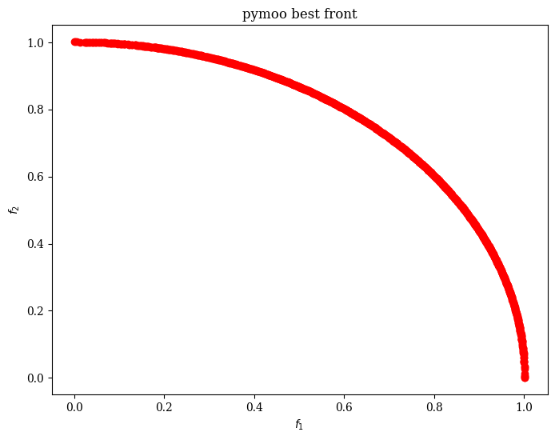
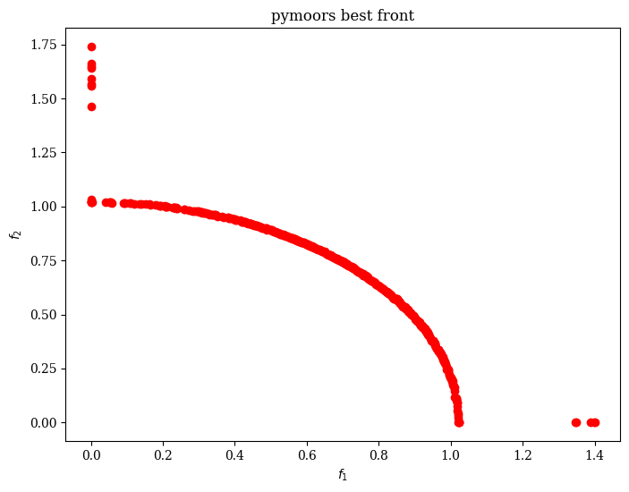

# pymoors


[](https://codecov.io/gh/andresliszt/pymoors)

## Overview

This project aims to solve multi-objective optimization problems using genetic algorithms. It is a hybrid implementation combining Python and Rust, leveraging the power of [PyO3](https://github.com/PyO3/pyo3) to bridge the two languages. This project was inspired in the amazing python project [pymoo](https://github.com/anyoptimization/pymoo).

## Features

- **Multi-Objective Optimization**: Implementations of popular multi-objective genetic algorithms like NSGA-II and NSGA-III.
- **Hybrid Python and Rust**: Core computational components are written in Rust for performance, while the user interface and high-level API are provided in Python.
- **Extensible Operators**: Support for various sampling, mutation, crossover, and survival operators.
- **Constraint Handling**: Ability to handle constraints in optimization problems.


## Installation

To install the package you simply can do

```sh
pip install pymoors
```

## Small Example

Here is an example of how to use the `pymoors` package to solve a small problem using the NSGA-II algorithm:

```python
import numpy as np
from pymoors import (
    Nsga2,
    BitFlipMutation,
    SinglePointBinaryCrossover,
    RandomSamplingBinary,
    ExactDuplicatesCleaner,
)

def fitness_onemax_zeromax(population_genes):
    """
    Multi-objective fitness function for a binary problem.

    We define two objectives:
      Objective 1: Maximize the number of ones. Since pymoors minimizes fitness, we return -sum(ones).
      Objective 2: Maximize the number of zeros. Since pymoors minimizes fitness, we return -sum(zeros).

    For a binary vector, sum(zeros) = n_vars - sum(ones).

    Args:
        population_genes (np.ndarray): A binary matrix where each row is a candidate solution.

    Returns:
        np.ndarray: An (n x 2) fitness matrix with two objectives per candidate.
    """
    n_vars = population_genes.shape[1]
    sum_ones = population_genes.sum(axis=1)
    sum_zeros = n_vars - sum_ones
    return np.column_stack([-sum_ones, -sum_zeros])

# There are no constraints for this simple problem.
constraints = None

# Create the NSGA-II algorithm instance for our multi-objective binary problem.
algorithm = Nsga2(
    sampler=RandomSamplingBinary(),               # Initialize binary solutions
    crossover=SinglePointBinaryCrossover(),         # Use single-point crossover
    mutation=BitFlipMutation(gene_mutation_rate=0.2), # Bit-flip mutation operator (per gene mutation rate)
    fitness_fn=fitness_onemax_zeromax,              # Our multi-objective fitness function
    constraints_fn=constraints,                     # No constraints
    duplicates_cleaner=ExactDuplicatesCleaner(),    # Clean exact duplicates
    n_vars=10,                                      # 10-bit binary strings
    pop_size=50,                                    # Population size of 50
    n_offsprings=25,                                # 25 offspring per generation
    num_iterations=50,                              # Run for 50 generations
    mutation_rate=0.1,                              # Overall mutation rate
    crossover_rate=0.9,                             # Crossover rate
    keep_infeasible=False,
    lower_bound = 0
    upper_bound = 1
)

# Run the algorithm
algorithm.run()

# Retrieve the final population of solutions
final_population = algorithm.population
# Retrieve the best individuals (those with rank = 0, i.e. Pareto front)
best = final_population.best

print("Best solutions (Pareto front):")
for ind in best:
    print(ind)

```

## Constraints handling


In **pymoors**, constraints are provided as a **Python function** that operates at the **population level**—i.e., it takes a 2D NumPy array (`(N, d)` shape, where each row corresponds to one individual) and returns a 2D array (`(N, k)`) of constraint evaluations. Each individual is considered **feasible** if **all** its constraint values are **strictly less than 0**.


Below is a simplified example constraint function for a 2-gene problem, where $(x_1 + 2x_2 \leq 10)$. We return an array of shape `(N, 1)`:

```python
import numpy as np

from pymoors.typing import TwoDArray

def constraints_fn(population_genes: TwoDArray) -> TwoDArray:
    """
    Each row in population_genes corresponds to one individual.
    Suppose our constraint is x1 + 2*x2 <= 10 (two genes per individual).
    We'll return an array of shape (N,1), where values < 0 indicate feasibility.
    """
    lhs = population_genes[:, 0] + 2.0 * population_genes[:, 1]
    return (lhs - 10.0)[:, np.newaxis]
```

To handle approximate equality constraints, one common trick is to transform them into inequality constraints. For example, if you have an equality ($g(x) = 0$) and you want  tolerance, define: $g_{\text{ineq}}(x) = |g(x)| - \epsilon < 0.$

#### Example: Enforcing $( x_1 + 2x_2 = 5 )$ with ($\epsilon = 0.1$)

```python
import numpy as np

from pymoors.typing import TwoDArray

def equality_constraint_fn(population_genes: TwoDArray) -> TwoDArray:
    """
    Enforce the approximate equality constraint: x1 + 2*x2 ≈ 5
    Using the transformation: abs(h(x)) - epsilon < 0
    """
    h = population_genes[:, 0] + 2.0 * population_genes[:, 1] - 5.0  # h(x) = x1 + 2*x2 - 5
    epsilon = 0.1
    return (np.abs(h) - epsilon)[:, np.newaxis]  # Feasible if < 0
```


## Comparison of `pymoo` vs. `pymoors`

In our performance evaluation, we compare **pymoo** and **pymoors** using an identical test problem, ensuring that both libraries use:

- **The same numpy-based fitness function:**
  Our test problem is defined with a common numpy function that computes the fitness values for each candidate solution.

- **Identical genetic operators:**
  Both libraries employ the same selection, crossover, and mutation operators. This guarantees that the evolutionary process is consistent across both implementations.

- **The same duplicate remover:**
  The duplicate remover used in both libraries is based on Euclidean distance closeness. Specifically, duplicates are eliminated by first computing the full pairwise Euclidean distance matrix among the new offspring and then between the offspring and the current population.

  > **Note:**
  The default duplicate remover in pymoo is based on this Euclidean distance criterion using scipy [cdist](https://docs.scipy.org/doc/scipy/reference/generated/scipy.spatial.distance.cdist.html) function . When both the population size and the number of offspring per generation are high, eliminating duplicates using this logic becomes costly because calculating the distance matrix is an $O(n^2)$ operation. Consequently, the computational cost of duplicate elimination grows quadratically with the number of individuals.

  > **Note:**
   In real-valued optimization problems, using a Euclidean distance criterion for duplicate elimination is often preferred over exact duplicate detection. This is because individuals that are **almost identical** (nearly duplicates) do not contribute significantly to the diversity of the population, and a duplicates cleaner based solely on exact equality may fail to detect these near-duplicates.

## Performance Implications

In both, `pymoo` and `pymoors`, the duplicate elimination process involves computing the pairwise Euclidean distance matrix over all new offspring, followed by a comparison against the current population. For large populations, this can lead to significant computational overhead due to the \(O(n^2)\) complexity of the distance matrix calculation.


## Comparison of `pymoo` vs. `pymoors` for the DTLZ2 Problem

Below we present the performance comparison between **pymoo** and **pymoors** for the DTLZ2 problem. In this test, the population size is set equal to the number of offsprings. The table below shows the results for **pymoo** using different values for `pop_size = n_offsprings` along with their corresponding execution times (in seconds):

In our experiments, we used the same DTLZ2 problem, numpy-based fitness function, identical genetic operators, and the same duplicate remover for both libraries. The default duplicate remover in `pymoo` is based on Euclidean distance closeness rather than exact duplicate elimination. This approach, while ensuring that nearly identical individuals (which do not contribute significantly to diversity) are not retained, becomes computationally expensive when both the population size and number of offspring per generation are high (since computing the full distance matrix is $O(n^2)$.

### `pymoo` implementation of DTLZ2 problem

```python

# pymoo code

import time

import numpy as np
from pymoo.core.problem import Problem
from pymoo.algorithms.moo.nsga2 import NSGA2
from pymoo.optimize import minimize
from pymoo.operators.mutation.gauss import GaussianMutation
from pymoo.operators.crossover.sbx import SimulatedBinaryCrossover

class DTLZ2(Problem):
    """
    DTLZ2 is a classical multi-objective benchmark problem.

    The decision vector x is split into two parts:
      - The first (n_obj - 1) variables define the position on the Pareto front.
      - The remaining variables (k = n_var - n_obj + 1) are used to compute the auxiliary function g.

    The objective functions are defined as:
        f_i(x) = (1 + g(x_M)) * prod_{j=1}^{n_obj-i-1} cos(x_j * pi/2) * (if i > 0 then sin(x_{n_obj-i} * pi/2))

    For this example, we set:
      - n_var = 50 (to make the problem computationally more expensive)
      - n_obj = 2
    """

    def __init__(self, n_var=50, n_obj=2):
        super().__init__(n_var=n_var, n_obj=n_obj, xl=0.0, xu=1.0)

    def _evaluate(self, X, out, *args, **kwargs):
        # k is the number of variables that contribute to the auxiliary function g.
        k = self.n_var - self.n_obj + 1

        # Compute g as the sum of squared deviations from 0.5 for the last k decision variables.
        g = np.sum((X[:, -k:] - 0.5) ** 2, axis=1)

        # Compute each objective.
        F = []
        for i in range(self.n_obj):
            # Start with the term (1 + g)
            f_i = 1 + g
            # Multiply by cos(x_j * pi/2) for j = 0 to n_obj-i-2
            for j in range(self.n_obj - i - 1):
                f_i *= np.cos(X[:, j] * np.pi / 2)
            # For i > 0, multiply by sin(x_{n_obj-i-1} * pi/2)
            if i > 0:
                f_i *= np.sin(X[:, self.n_obj - i - 1] * np.pi / 2)
            F.append(f_i)

        # Stack the list into a 2D array of shape (n_samples, n_obj)
        out["F"] = np.column_stack(F)


# Instantiate the DTLZ2 problem with 50 decision variables and 3 objectives.
problem = DTLZ2(n_var=50, n_obj=3)
# Container for the time
times = []
for n in (1000, 2000, 3000, 4000, 5000, 6000):
    st = time.time()
    algorithm = NSGA2(
        pop_size=n,
        n_offsprings=n,
        eliminate_duplicates=True,
        mutation=GaussianMutation(prob = 0.1),
        crossover=SimulatedBinaryCrossover(prob = 0.9)
    )
    result = minimize(problem, algorithm, ("n_gen", 10), seed=1, verbose=True)
    times.append(time.time() - st)

print(times)
```

### `pymoors` implementation of DTLZ2 problem

```python

# pymoors code

import time

import numpy as np

from pymoors import (
    Nsga2,
    RandomSamplingFloat,
    GaussianMutation,
    CloseDuplicatesCleaner,
    SimulatedBinaryCrossover,
)

N_VARS = 50
N_OBJ = 2

def fitness(genes):
    # k is the number of variables that contribute to the auxiliary function g.
    k = N_VARS - N_OBJ + 1

    # Compute g as the sum of squared deviations from 0.5 for the last k decision variables.
    g = np.sum((genes[:, -k:] - 0.5) ** 2, axis=1)

    # Compute each objective.
    F = []
    for i in range(N_OBJ):
        # Start with the term (1 + g)
        f_i = 1 + g
        # Multiply by cos(x_j * pi/2) for j = 0 to n_obj-i-2
        for j in range(N_OBJ - i - 1):
            f_i *= np.cos(genes[:, j] * np.pi / 2)
        # For i > 0, multiply by sin(x_{n_obj-i-1} * pi/2)
        if i > 0:
            f_i *= np.sin(genes[:, N_OBJ - i - 1] * np.pi / 2)
        F.append(f_i)

    # Stack the list into a 2D array of shape (n_samples, n_obj)
    return np.column_stack(F)

times = []

for n in [1000, 2000, 3000, 4000, 5000, 6000]:
    st = time.time()
    algorithm = Nsga2(
        sampler=RandomSamplingFloat(min=0.0, max=1.0),
        crossover=SimulatedBinaryCrossover(distribution_index=2),
        mutation=GaussianMutation(gene_mutation_rate=0.1, sigma=0.05),
        fitness_fn=fitness,
        n_vars=50,
        pop_size=n,
        n_offsprings=n,
        num_iterations=10,
        mutation_rate=0.1,
        crossover_rate=0.9,
        duplicates_cleaner=CloseDuplicatesCleaner(epsilon=1e-5),
        keep_infeasible=False,
        lower_bound=0,
        upper_bound=1
    )
    algorithm.run()

    times.append(time.time() - st)

print(times)

```

### Comparison with Euclidean distance duplicate Removal

Below is the performance comparison, for simplicity each run used 10 iterations:

## Performance Comparison: Exact Duplicate Removal (pymoors)

In this experiment, we compare the performance of **pymoo** and **pymoors** for the DTLZ2 problem using exact duplicate removal. The table below presents the execution times (in seconds) for each library, where the population size is set equal to the number of offspring. Note that an equivalent duplicate remover for pymoo is not currently implemented (this is a TODO for this README). The speedup factor is computed as:

\[
\text{Speedup} = \frac{\text{Execution Time (pymoo)}}{\text{Execution Time (pymoors)}}
\]

<table>
  <thead>
    <tr>
      <th style="text-align: center;">pop_size = n_offsprings</th>
      <th style="text-align: center;">Execution Time (pymoo, s)</th>
      <th style="text-align: center;">Execution Time (pymoors, s)</th>
      <th style="text-align: center;">Speedup (pymoo / pymoors)</th>
    </tr>
  </thead>
  <tbody>
    <tr>
      <td style="text-align: center;">1000</td>
      <td style="text-align: center;">1.46435</td>
      <td style="text-align: center;">0.32932</td>
      <td style="text-align: center;">4.45x</td>
    </tr>
    <tr>
      <td style="text-align: center;">2000</td>
      <td style="text-align: center;">4.08828</td>
      <td style="text-align: center;">1.26430</td>
      <td style="text-align: center;">3.23x</td>
    </tr>
    <tr>
      <td style="text-align: center;">3000</td>
      <td style="text-align: center;">8.76817</td>
      <td style="text-align: center;">2.81986</td>
      <td style="text-align: center;">3.11x</td>
    </tr>
    <tr>
      <td style="text-align: center;">4000</td>
      <td style="text-align: center;">15.11166</td>
      <td style="text-align: center;">4.77063</td>
      <td style="text-align: center;">3.17x</td>
    </tr>
    <tr>
      <td style="text-align: center;">5000</td>
      <td style="text-align: center;">23.92205</td>
      <td style="text-align: center;">8.30751</td>
      <td style="text-align: center;">2.88x</td>
    </tr>
    <tr>
      <td style="text-align: center;">6000</td>
      <td style="text-align: center;">34.27789</td>
      <td style="text-align: center;">11.32571</td>
      <td style="text-align: center;">3.03x</td>
    </tr>
  </tbody>
</table>

### Comparison Without Duplicate Removal

In this experiment, we compare **pymoo** and **pymoors** without applying any duplicate removal. This test isolates the performance of the core evolutionary operators. The table below shows the execution times (in seconds) for both libraries over various population sizes (which are equal to the number of offspring), along with the computed speedup factor (i.e. how many times faster pymoors is compared to pymoo).

<table>
  <thead>
    <tr>
      <th style="text-align: center;">pop_size = n_offsprings</th>
      <th style="text-align: center;">Execution Time (pymoo, s)</th>
      <th style="text-align: center;">Execution Time (pymoors, s)</th>
      <th style="text-align: center;">Speedup (pymoo / pymoors)</th>
    </tr>
  </thead>
  <tbody>
    <tr>
      <td style="text-align: center;">1000</td>
      <td style="text-align: center;">0.87656</td>
      <td style="text-align: center;">0.05015</td>
      <td style="text-align: center;">17.5x</td>
    </tr>
    <tr>
      <td style="text-align: center;">2000</td>
      <td style="text-align: center;">1.92322</td>
      <td style="text-align: center;">0.10421</td>
      <td style="text-align: center;">18.47x</td>
    </tr>
    <tr>
      <td style="text-align: center;">3000</td>
      <td style="text-align: center;">3.63963</td>
      <td style="text-align: center;">0.19218</td>
      <td style="text-align: center;">18.95x</td>
    </tr>
    <tr>
      <td style="text-align: center;">4000</td>
      <td style="text-align: center;">5.76844</td>
      <td style="text-align: center;">0.29089</td>
      <td style="text-align: center;">19.84x</td>
    </tr>
    <tr>
      <td style="text-align: center;">5000</td>
      <td style="text-align: center;">9.33128</td>
      <td style="text-align: center;">0.42372</td>
      <td style="text-align: center;">22.02x</td>
    </tr>
    <tr>
      <td style="text-align: center;">6000</td>
      <td style="text-align: center;">12.50804</td>
      <td style="text-align: center;">0.59521</td>
      <td style="text-align: center;">21.01x</td>
    </tr>
  </tbody>
</table>

### Performance of pymoors using `pymoors.ExactDuplicatesCleaner`

Below are the performance results for **pymoors** when using the `pymoors.ExactDuplicatesCleaner` (which is based on Rust’s `HashSet`) for duplicate removal. In this test, the population size is set equal to the number of offspring. Note that an equivalent duplicate remover for **pymoo** is not currently shown (this is a TODO for this README).

<table>
  <thead>
    <tr>
      <th style="text-align: center;">pop_size = n_offsprings</th>
      <th style="text-align: center;">Execution Time (pymoors, s)</th>
    </tr>
  </thead>
  <tbody>
    <tr>
      <td style="text-align: center;">1000</td>
      <td style="text-align: center;">0.09403</td>
    </tr>
    <tr>
      <td style="text-align: center;">2000</td>
      <td style="text-align: center;">0.24729</td>
    </tr>
    <tr>
      <td style="text-align: center;">3000</td>
      <td style="text-align: center;">0.36452</td>
    </tr>
    <tr>
      <td style="text-align: center;">4000</td>
      <td style="text-align: center;">0.55608</td>
    </tr>
    <tr>
      <td style="text-align: center;">5000</td>
      <td style="text-align: center;">0.77325</td>
    </tr>
    <tr>
      <td style="text-align: center;">6000</td>
      <td style="text-align: center;">0.90666</td>
    </tr>
  </tbody>
</table>

## Comparing the Best Front Found (Solutions with Rank = 0)

The experiment was conducted with 500 iterations and a population size of 1000. It should be noted that both pymoo and pymoors achieved a best front of size 1000 (i.e. `len(best) = pop_size = 1000`).

### pymoo



In pymoo, the Pareto front is more clearly defined, with all individuals satisfying $0 <= f_1 <= 1$ and \($0 <= f_2 <= 1$).

### pymoors



In contrast, for pymoors there are some individuals that do not meet these conditions, which suggests that there is still significant room for optimization!
